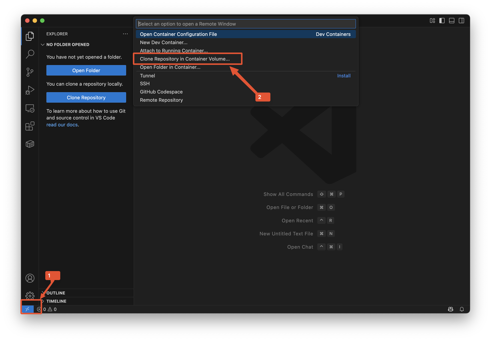
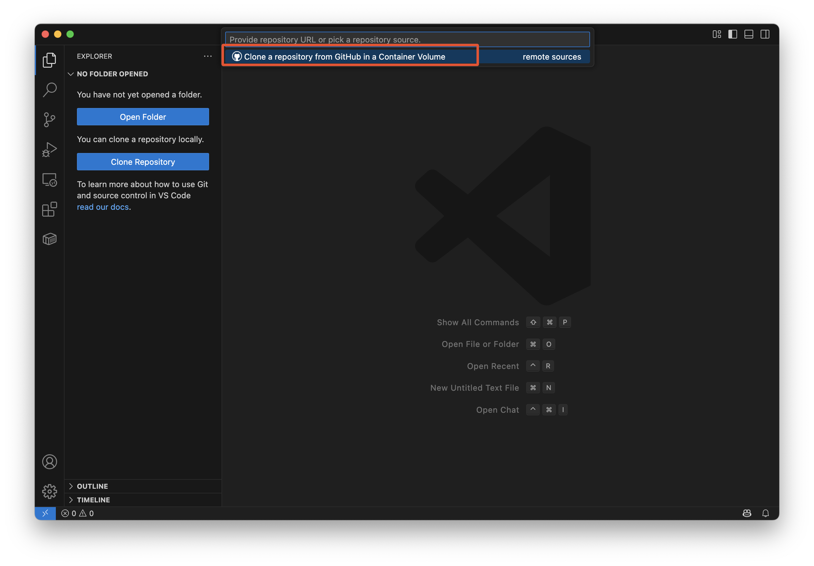
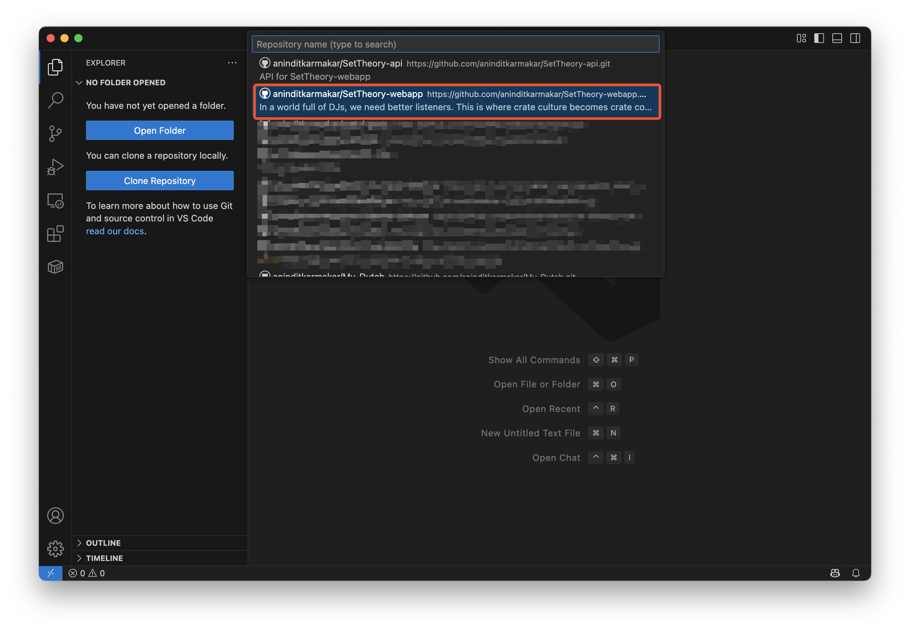
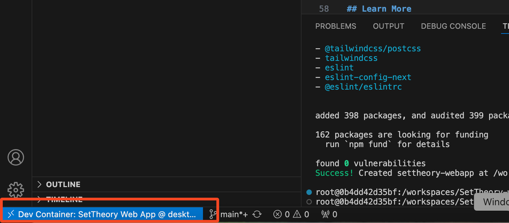
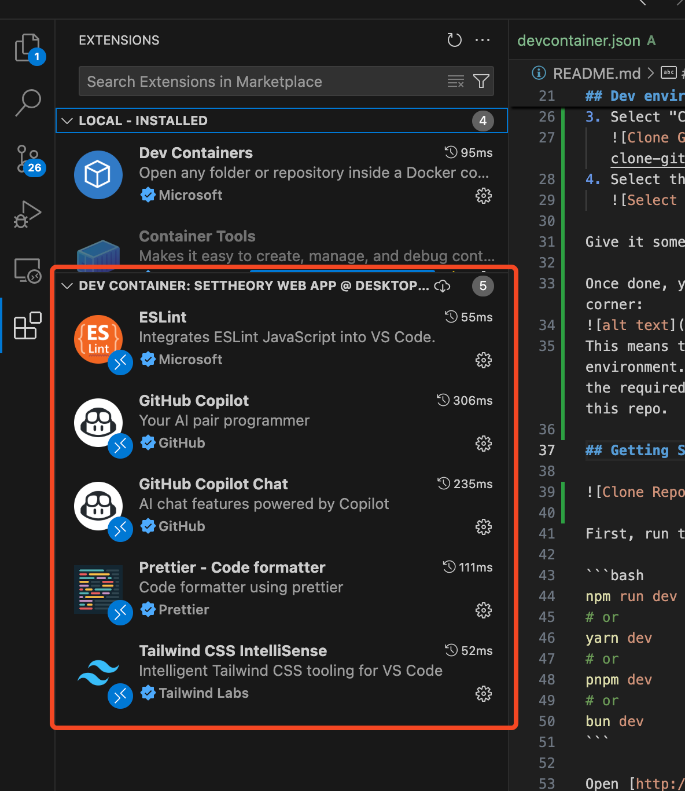
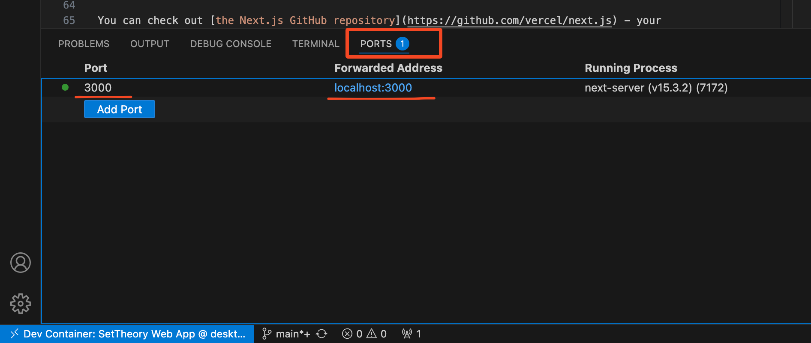

This is a [Next.js](https://nextjs.org) project bootstrapped with [`create-next-app`](https://nextjs.org/docs/app/api-reference/cli/create-next-app).

## Things to Install

1. Install [Docker Desktop](https://www.docker.com/products/docker-desktop/)
2. Install [VS Code](https://code.visualstudio.com/)
3. Intall the following VS Code extensions:
   - [Container Tools](https://marketplace.visualstudio.com/items?itemName=ms-azuretools.vscode-containers)
   - [Dev Containers](https://marketplace.visualstudio.com/items?itemName=ms-vscode-remote.remote-containers)
   - Restart VSCode after installing extensions

## Docker + DevContainers

This project uses the magic of Docker and Dev Containers for the dev environment that is completely isolated from your physical machine. This is so that developers don't have to worry about things like:

- I already have NodeJS 18 installed on my system. This project uses NodeJS 22. What do I do? I can't uninstall Node 18 because my other projects depend on it.
- My VS Code has CodeFormatterExtentionA that I use to format my code each time I save. But this project has its own formatting rules enforced by Prettier. That's going to clash with my code formatting extension.

With VS Code and Dev Containers, you can spin up a dedicated docker container containing all the tools and technology required to get started coding immediately.

## Dev environment setup

1. Click the _><_ icon at the bottom left of Visual Studio code. (This icon will show up if you have installed the DevContainers extension.)
2. Select "Clone Repository in Container Volume"
   
3. Select "Clone a repository from GitHub in a Container Volume"
   
4. Select this repo
   

Give it some time to create the Docker container and run the setup.

Once done, your VS Code window should show this in the bottom left corner:


This means that you are now working in your isolated development environment. You will notice that this VS Code session will have all the required extensions that developers are expected to work with in this repo.


## Getting Started

The following commands should be run from the integrated Terminal inside the VS Code session that is connected to the Dev Container.

To run the web app

```bash
npm run dev
```

This will start the app on the port 3000 inside the container. However, VS Code will automatically forward the port to your host machine.


Open [http://localhost:3000](http://localhost:3000) with your browser to see the result.

You can start editing the page by modifying `app/page.tsx`. The page auto-updates as you edit the file.

This project uses [`next/font`](https://nextjs.org/docs/app/building-your-application/optimizing/fonts) to automatically optimize and load [Geist](https://vercel.com/font), a new font family for Vercel.

## Learn More

To learn more about Next.js, take a look at the following resources:

- [Next.js Documentation](https://nextjs.org/docs) - learn about Next.js features and API.
- [Learn Next.js](https://nextjs.org/learn) - an interactive Next.js tutorial.

You can check out [the Next.js GitHub repository](https://github.com/vercel/next.js) - your feedback and contributions are welcome!

## Deploy on Vercel

The easiest way to deploy your Next.js app is to use the [Vercel Platform](https://vercel.com/new?utm_medium=default-template&filter=next.js&utm_source=create-next-app&utm_campaign=create-next-app-readme) from the creators of Next.js.

Check out our [Next.js deployment documentation](https://nextjs.org/docs/app/building-your-application/deploying) for more details.
